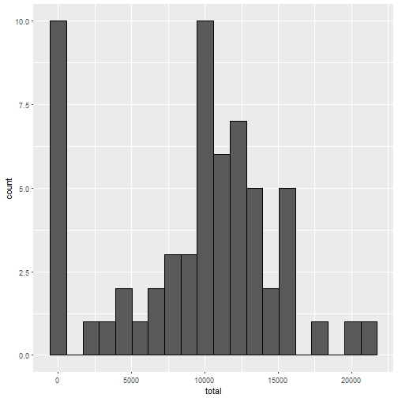
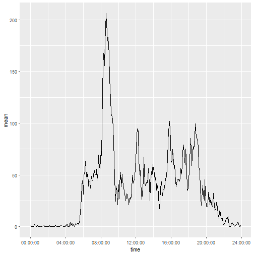
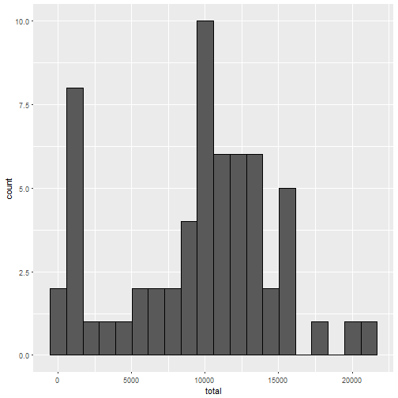
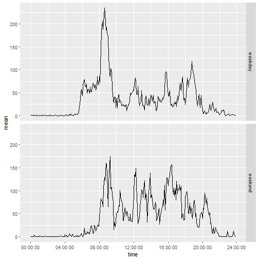

Peer-graded assignment for week 2
=================================
Wouter van Snippenburg

## Loading and preprocessing the data

```r
library(dplyr, warn.conflicts = FALSE)
activity <- tbl_df(read.csv("activity.csv"))
activity <- mutate(activity,
                   time = as.POSIXct((floor(interval / 100)*60 + interval %% 100)*60,
                                     origin = strptime("1970/01/01",
                                                       format = "%Y/%m/%d",
                                                       tz = "GMT")))
```

## What is the mean total number of steps taken per day?

```r
library(ggplot2)
perday <- group_by(activity, date) %>% summarise(total = sum(steps, na.rm = TRUE))
ggplot(perday, aes(total)) + geom_histogram(bins = 20, color = "black")
```



The mean number of total steps per day is 9354.2295082, the median
number of total steps per day is 10395

## What is the average daily activity pattern?

```r
perinterval <- group_by(activity, time) %>% summarise(mean = mean(steps, na.rm = TRUE))
ggplot(perinterval, aes(time, mean)) + geom_line() +
    scale_x_time(breaks = c(0, 4, 8, 12, 16, 20, 24)*60*60)
```



The 5-minute interval that on average contains the maximum number of steps is 09:35

## Imputing missing values
Number of rows with missing data: 2304

Impute missing data: replace NAs with median number of steps for the same
interval of all other dates

```r
imputed <- group_by(activity, time) %>%
    mutate(steps = ifelse(is.na(steps), median(steps, na.rm = TRUE), steps))

perday <- group_by(imputed, date) %>% summarise(total = sum(steps, na.rm = TRUE))
ggplot(perday, aes(total)) + geom_histogram(bins = 20, color = "black")
```



The mean number of total steps per day is 9503.8688525, the median
number of total steps per day is 10395

## Are there differences in activity patterns between weekdays and weekends?

```r
daynum <- strptime(activity$date, format = "%Y-%m-%d") %>% format("%u")
activity <- mutate(activity, daytype = factor(daynum >= 6, labels = c("weekday", "weekend")))

perinterval <- group_by(activity, daytype, time) %>% summarise(mean = mean(steps, na.rm = TRUE))
ggplot(perinterval, aes(time, mean)) + geom_line() +
    scale_x_time(breaks = c(0, 4, 8, 12, 16, 20, 24)*60*60) +
    facet_grid(daytype ~ .)
```


